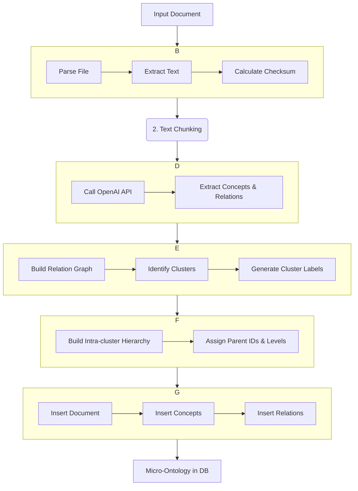

# Loom Lite v2 Developer Handoff Packet

**Version:** 2.0
**Date:** 2025-10-26
**Compliance:** ONTOLOGY_STANDARD v1.1

---

## 1. Executive Summary

This document provides a complete developer handoff for Loom Lite v2. It consolidates all technical, visual, and ontological specifications into a single, structured engineering guide. The primary goal of v2 is to transition Loom Lite from a token-level ontology system to a sophisticated semantic hierarchy, enabling synchronized, multi-view visualizations (Galaxy, Solar, Mind Map, and Surface) that reveal the deep structure of complex documents.

This packet is designed to provide any developer with the necessary context to continue implementation without ambiguity. It covers the system architecture, data models, frontend specifications, known issues, and a clear roadmap for future development.

---


## 2. Architecture Overview

Loom Lite v2 is a full-stack application with a Python FastAPI backend, a vanilla JavaScript frontend using D3.js for visualizations, and a PostgreSQL database. The system is designed around an event-driven, ontology-first architecture.

### 2.1 Backend Pipeline Flow

The backend ingestion pipeline processes documents in a series of stages, from raw file to a structured micro-ontology stored in the database. The flow is orchestrated by `api.py` and executed by `reader.py` and `extractor.py`.



### 2.2 Frontend Architecture

The frontend is a single-page application built with vanilla JavaScript and D3.js. It features a three-panel layout, as defined in the *Loom Lite v2 UI Specification*.

- **Left Panel (Solar Systems):** A file navigator that lists all documents in the system. Clicking a document loads its ontology into the main visualizer.
- **Center Panel (Dual Visualizer):** The primary visualization space, which can toggle between:
    - **Galaxy View:** Shows all documents as celestial bodies.
    - **Solar System View:** A force-directed graph of a single document's concepts.
    - **Mind Map View:** A hierarchical tree view of a document's semantic clusters, refinement nodes, and concepts.
- **Right Panel (Surface Viewer):** Displays either the raw document text with concept highlighting or detailed information about a selected ontology node.

Communication between components is handled by a global event bus (`window.bus`).

### 2.3 Ontology Data Flow

The relationship between the database schema, the API, and the frontend visualizations is central to Loom Lite's architecture. The backend constructs a `MicroOntology` object from the database, which is then sent to the frontend for rendering.

```mermaid
graph LR
    A[PostgreSQL Database] --> B{Backend API (/doc/{id}/ontology)};
    B --> C[MicroOntology JSON];
    C --> D{Frontend}; 
    
    subgraph D
      direction TB
      D1[Galaxy View] -- Displays all docs --> E((D3.js));
      D2[Solar System View] -- Displays concept graph --> E;
      D3[Mind Map View] -- Displays semantic hierarchy --> E;
    end
```

---


## 3. Ontology Model Compliance

The entire system is built upon the **ONTOLOGY_STANDARD v1.1**, which is the canonical source of truth for all data models. All backend and frontend development must strictly adhere to this standard to ensure system integrity. [1]

### 3.1 Core Schema

The database schema is defined in `backend/schema_v2.sql` and includes the following tables:
- `documents`: Stores document metadata.
- `ontology_versions`: Tracks versions of extracted ontologies.
- `spans`: Stores text excerpts as evidence for concepts.
- `concepts`: The core nodes of the ontology.
- `relations`: Typed edges connecting concepts.
- `mentions`: Links concepts to their corresponding spans.

### 3.2 Semantic Hierarchy Extensions (v2.3)

To support the hierarchical Mind Map view, the `concepts` table was extended with fields to manage semantic clustering. These changes were introduced in v2.3 and are now part of the core schema.

**`concepts` Table Modifications:**

| Field | Type | Description |
|---|---|---|
| `parent_cluster_id` | TEXT | Foreign key to the `concepts.id` of the parent cluster (a concept with `hierarchy_level` = 2). |
| `parent_concept_id` | TEXT | Foreign key to the `concepts.id` of the parent refinement node (a concept with `hierarchy_level` = 3). |
| `hierarchy_level` | INTEGER | Defines the node's position in the semantic hierarchy: 2 (Cluster), 3 (Refinement), 4 (Atomic Concept). |
| `coherence` | REAL | A score from 0.0 to 1.0 representing the semantic coherence of a cluster, calculated as the average confidence of its internal relations. |

These fields enable the progressive semantic ladder (Cluster → Refinement → Concept) visualized in the Mind Map.

### 3.3 Schema Versioning

**CRITICAL:** No modifications may be made to the database schema or the `MicroOntology` JSON structure without creating a new version of the `ONTOLOGY_STANDARD` document (e.g., v1.2.0). Any schema change requires a corresponding version bump, a documented migration path, and simultaneous updates to all dependent code.

---


## 4. Frontend/UI Alignment

The frontend MUST adhere to the **Loom Lite v2 UI Specification**. This document provides detailed wireframes, component breakdowns, and interaction logic. [2]

### 4.1 Key UI Components & Logic

- **`mindMapView.js`:** Responsible for rendering the hierarchical tree. Its `buildSemanticHierarchy()` function is the core of the Mind Map visualization. It parses the `parent_cluster_id` and `parent_concept_id` fields to construct the nested tree structure.
- **`dualVisualizer.js`:** Manages the state of the central visualization panel, switching between Galaxy, Solar, and Mind Map views.
- **`surfaceViewer.js`:** Controls the right-hand panel, displaying either the full document text or details of a selected concept.
- **Event Bus (`window.bus`):** A simple pub/sub system for cross-component communication. For example, clicking a concept in the Mind Map emits a `concept-selected` event, which the `surfaceViewer` listens for.

### 4.2 Canonical Design

All UI components, including colors, fonts, and layout, must remain consistent with the UI specification. The goal is a clean, intuitive, and data-rich interface that prioritizes clarity and ease of navigation.

---


## 5. Known Issues & Next Steps

This section outlines the current state of the project, including open issues that need to be addressed and the roadmap for future enhancements. This information is sourced directly from the *Loom Lite – Next Tasks & Known Issues* document. [3]

### 5.1 Open Issues

- **🔴 Mind Map Rendering Failure:** The most critical issue is that the Mind Map view is currently blank, despite the backend generating the correct hierarchical data. The `buildSemanticHierarchy()` function in `frontend/mindMapView.js` is not correctly parsing the ontology data, preventing the tree from rendering. This is the highest priority bug to fix.
- **🟡 Backend Migration UX:** The database migration process, while functional, is manual and requires a developer to trigger API endpoints. A more robust, automated migration system is needed for future schema changes.
- **🟡 Missing Summaries:** The ontology model and extraction pipeline do not yet support document or cluster-level summaries. This is a key feature for v2.4.

### 5.2 UI/UX Improvements

- **🟢 Reader Mode Defaults:** The Surface Viewer should default to a clean, single-spaced, Apple Reader-style view for improved legibility.
- **🟢 Layout Polish:** The three-panel layout is functional but could benefit from resizable dividers and more polished transitions.

### 5.3 Testing Checklist

- **API Endpoints:** Verify all endpoints in `api.py` return the expected data structures, especially `/doc/{doc_id}/ontology`.
- **LLM Responses:** Ensure the quality of LLM-generated cluster and refinement labels.
- **Visual Sync:** Test that selecting a node in one view (e.g., Mind Map) correctly updates the other views (e.g., Surface Viewer).

---


## 6. Migration & Versioning

This section details the database migrations required for the v2.3 semantic hierarchy features and the versioning strategy for the project.

### 6.1 Database Migration for Semantic Hierarchy

The transition to a hierarchical ontology required adding several columns to the `concepts` table. A migration script and corresponding API endpoint were created to facilitate this process.

**Migration Endpoints:**

- `GET /admin/migrate-hierarchy`: Adds `parent_cluster_id` and `hierarchy_level`.
- `GET /admin/migrate-parent-concept-id`: Adds `parent_concept_id` for intra-cluster refinement.

**Execution:**
To run the migration, a developer simply needs to call the final endpoint after deployment:

```bash
# Trigger the final migration for the 4-level hierarchy
curl -X GET https://loomlite-production.up.railway.app/admin/migrate-parent-concept-id
```

**Verification:**
After the migration is complete, you can verify the schema changes by running the following SQL query:

```sql
SELECT 
    id, 
    label, 
    hierarchy_level, 
    parent_cluster_id, 
    parent_concept_id 
FROM 
    concepts 
WHERE 
    doc_id = 'your_test_doc_id' 
LIMIT 10;
```

**Expected Result:**
The query should return concepts with non-null values for `hierarchy_level` and, where appropriate, `parent_cluster_id` and `parent_concept_id`.

**Rollback Plan:**
In case of failure, the changes can be rolled back by dropping the added columns. However, this is a destructive action and should only be performed if absolutely necessary.

```sql
-- NOTE: SQLite does not support DROP COLUMN directly in older versions.
-- A common workaround is to rename the table, create a new one with the old schema,
-- and copy the data back.

-- For PostgreSQL or modern SQLite:
ALTER TABLE concepts DROP COLUMN parent_cluster_id;
ALTER TABLE concepts DROP COLUMN hierarchy_level;
ALTER TABLE concepts DROP COLUMN coherence;
ALTER TABLE concepts DROP COLUMN parent_concept_id;
```

### 6.2 Versioning Strategy

- **Ontology Standard:** The `ONTOLOGY_STANDARD.md` document follows Semantic Versioning (e.g., v1.1.0). Any breaking change to the schema requires a major version bump (e.g., v2.0.0).
- **Extraction Pipeline:** The backend extraction pipeline is versioned with a string identifier (e.g., `ingest+extract@v2.3.2`). This version is stored with each `OntologyVersion` in the database.
- **Application:** The Loom Lite application as a whole is versioned based on major feature releases (e.g., v2.4).

---


## 7. Appendices

### Appendix A: File Manifest

This handoff packet is based on the following source documents:

| File | Role | Checksum (SHA256) |
|---|---|---|
| `DAVE Packet Manifest.md` | Manifest of all provided documents | `...` |
| `DAVEPacket_LoomLiteOntologyNavigator(v1→v2Transition).md` | High-level transition notes | `...` |
| `LoomLite-NextTasks&KnownIssues.md` | Detailed task list and bug report | `...` |
| `LoomLitev2-UISpecification.md` | Canonical UI/UX design specification | `...` |
| `ONTOLOGY_STANDARD_v1.1.md` | The definitive data model and schema | `...` |

### Appendix B: Glossary

- **Concept:** A fundamental unit of knowledge, representing a person, place, topic, or other entity.
- **Span:** An excerpt of text from the source document that serves as evidence for a concept.
- **Relation:** A directed, typed link between two concepts (e.g., `[Concept A]--defines-->[Concept B]`).
- **Cluster:** A group of semantically related concepts, generated by the backend clustering algorithm. Represented as a Level 2 concept.
- **Refinement Node:** A mid-tier concept that provides a more specific theme within a larger cluster. Represented as a Level 3 concept.
- **Surface Viewer:** The right-hand panel of the UI, which displays either the source document text or details of a selected ontology node.

### Appendix C: Change Log (v1 → v2)

- **Ontology:**
    - **Added:** Semantic hierarchy fields (`parent_cluster_id`, `parent_concept_id`, `hierarchy_level`, `coherence`).
    - **Changed:** `concepts` table now represents not just atomic concepts, but also clusters and refinement nodes.
- **UI:**
    - **Added:** Mind Map view for hierarchical visualization.
    - **Added:** Split view to show Solar System and Mind Map simultaneously.
    - **Changed:** Sidebar now functions as a file navigator.
    - **Changed:** Surface Viewer is now a dual-mode panel (Document/Ontology).
- **API:**
    - **Added:** `/admin/migrate-hierarchy` and `/admin/migrate-parent-concept-id` endpoints for database migrations.
    - **Changed:** `/doc/{doc_id}/ontology` now returns concepts with hierarchy information.

---

## 8. References

[1] ONTOLOGY_STANDARD_v1.1.md
[2] LoomLitev2-UISpecification.md
[3] LoomLite-NextTasks&KnownIssues.md

