# LoomLite v4.0 - System Flow Diagrams

**Visual Reference Guide for Architecture and Data Flow**

---

## Table of Contents

1. [System Architecture Diagram](#system-architecture-diagram)
2. [Module Dependency Graph](#module-dependency-graph)
3. [Event Bus Flow](#event-bus-flow)
4. [User Interaction Flows](#user-interaction-flows)
5. [Data Flow Diagrams](#data-flow-diagrams)
6. [Focus Mode State Machine](#focus-mode-state-machine)

---

## System Architecture Diagram

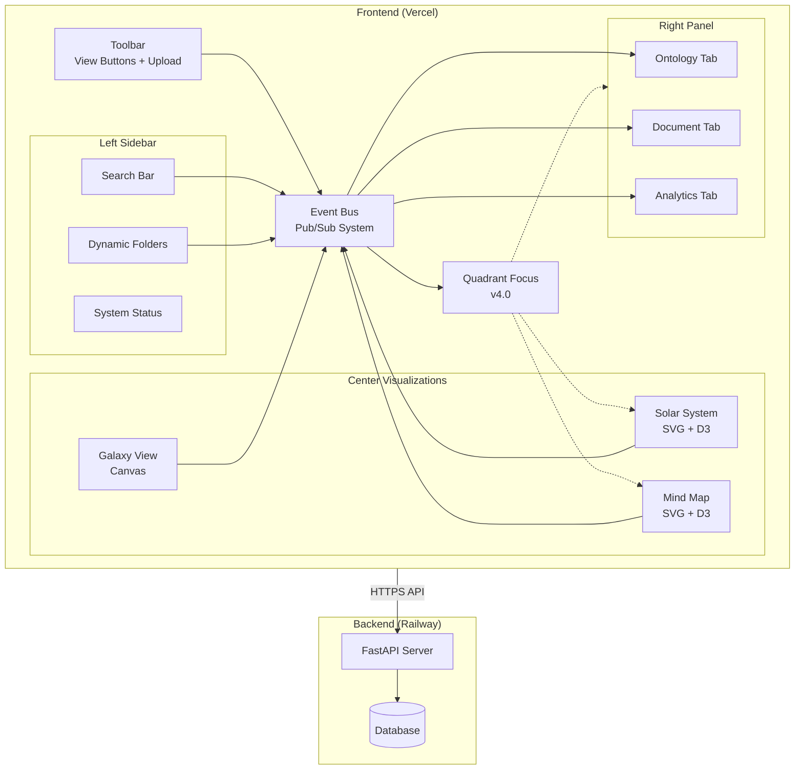
```mermaid
graph TB
    subgraph Frontend["Frontend (Vercel)"]
        Toolbar[Toolbar<br/>View Buttons + Upload]
        
        subgraph LeftPanel["Left Sidebar"]
            Search[Search Bar]
            Folders[Dynamic Folders]
            Status[System Status]
        end
        
        subgraph CenterPanel["Center Visualizations"]
            Galaxy[Galaxy View<br/>Canvas]
            Solar[Solar System<br/>SVG + D3]
            MindMap[Mind Map<br/>SVG + D3]
        end
        
        subgraph RightPanel["Right Panel"]
            Ontology[Ontology Tab]
            Document[Document Tab]
            Analytics[Analytics Tab]
        end
        
        EventBus[Event Bus<br/>Pub/Sub System]
        FocusSystem[Quadrant Focus<br/>v4.0]
    end
    
    subgraph Backend["Backend (Railway)"]
        API[FastAPI Server]
        DB[(Database)]
    end
    
    Toolbar --> EventBus
    Search --> EventBus
    Folders --> EventBus
    Galaxy --> EventBus
    Solar --> EventBus
    MindMap --> EventBus
    
    EventBus --> Ontology
    EventBus --> Document
    EventBus --> Analytics
    EventBus --> FocusSystem
    
    FocusSystem -.-> Solar
    FocusSystem -.-> MindMap
    FocusSystem -.-> RightPanel
    
    Frontend -->|HTTPS API| API
    API --> DB
```

---

## Module Dependency Graph

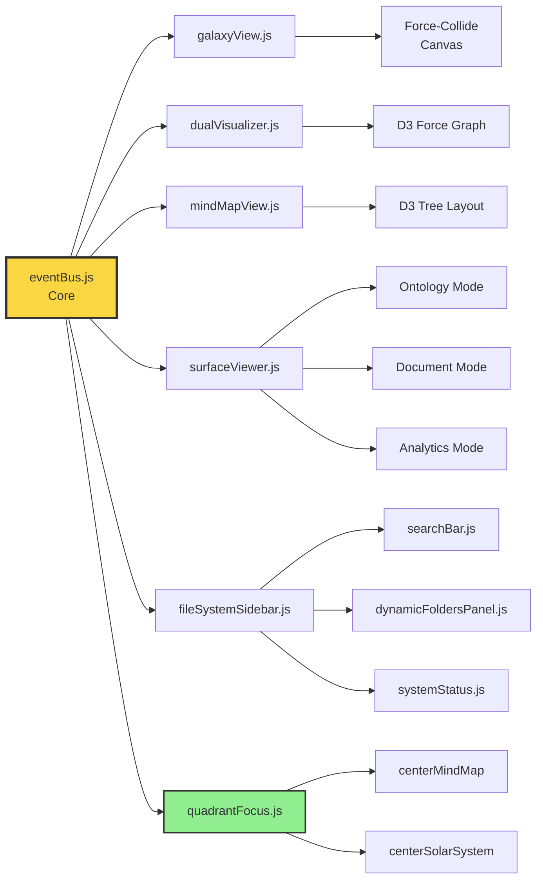
```mermaid
graph LR
    EventBus[eventBus.js<br/>Core]
    
    EventBus --> Galaxy[galaxyView.js]
    EventBus --> Dual[dualVisualizer.js]
    EventBus --> Mind[mindMapView.js]
    EventBus --> Surface[surfaceViewer.js]
    EventBus --> Sidebar[fileSystemSidebar.js]
    EventBus --> Focus[quadrantFocus.js]
    
    Galaxy --> ForceCollide[Force-Collide<br/>Canvas]
    Dual --> D3Force[D3 Force Graph]
    Mind --> D3Tree[D3 Tree Layout]
    
    Sidebar --> SearchBar[searchBar.js]
    Sidebar --> FoldersPanel[dynamicFoldersPanel.js]
    Sidebar --> StatusPanel[systemStatus.js]
    
    Surface --> OntologyMode[Ontology Mode]
    Surface --> DocumentMode[Document Mode]
    Surface --> AnalyticsMode[Analytics Mode]
    
    Focus --> CenterMind[centerMindMap]
    Focus --> CenterSolar[centerSolarSystem]
    
    style EventBus fill:#fad643,stroke:#333,stroke-width:3px
    style Focus fill:#90EE90,stroke:#333,stroke-width:2px
```

---

## Event Bus Flow

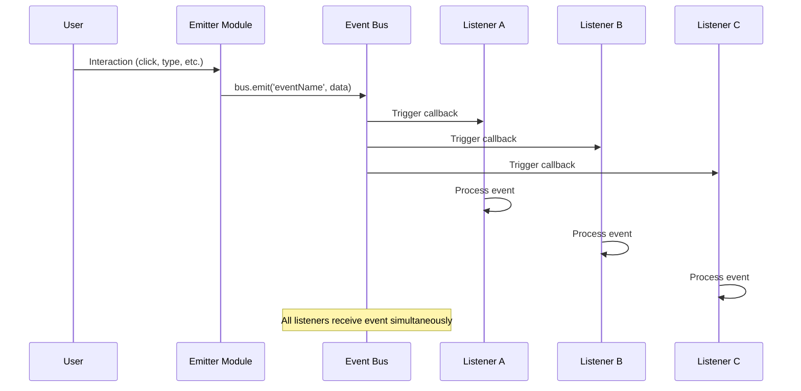
```mermaid
sequenceDiagram
    participant User
    participant Module as Emitter Module
    participant Bus as Event Bus
    participant ListenerA as Listener A
    participant ListenerB as Listener B
    participant ListenerC as Listener C
    
    User->>Module: Interaction (click, type, etc.)
    Module->>Bus: bus.emit('eventName', data)
    
    Bus->>ListenerA: Trigger callback
    Bus->>ListenerB: Trigger callback
    Bus->>ListenerC: Trigger callback
    
    ListenerA->>ListenerA: Process event
    ListenerB->>ListenerB: Process event
    ListenerC->>ListenerC: Process event
    
    Note over Bus: All listeners receive event simultaneously
```

---

## User Interaction Flows

### 1. Document Upload Flow

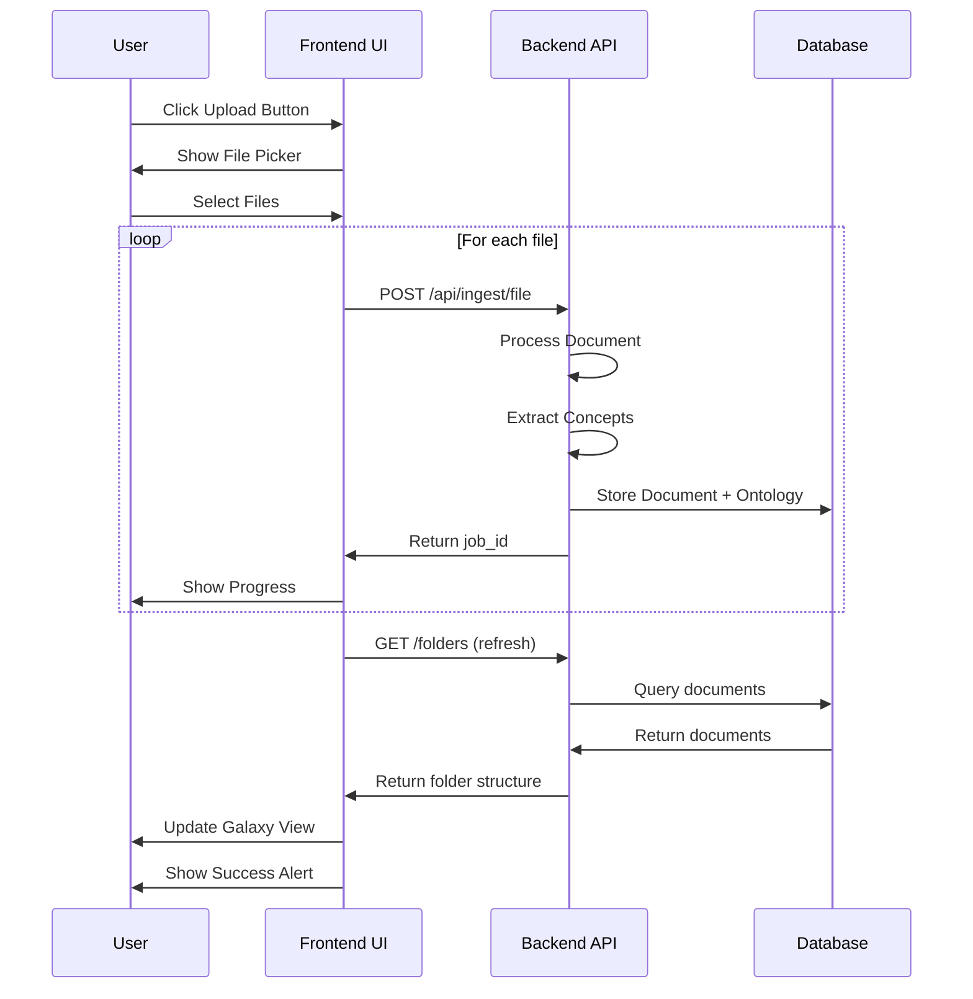
```mermaid
sequenceDiagram
    participant User
    participant UI as Frontend UI
    participant API as Backend API
    participant DB as Database
    
    User->>UI: Click Upload Button
    UI->>User: Show File Picker
    User->>UI: Select Files
    
    loop For each file
        UI->>API: POST /api/ingest/file
        API->>API: Process Document
        API->>API: Extract Concepts
        API->>DB: Store Document + Ontology
        API->>UI: Return job_id
        UI->>User: Show Progress
    end
    
    UI->>API: GET /folders (refresh)
    API->>DB: Query documents
    DB->>API: Return documents
    API->>UI: Return folder structure
    UI->>User: Update Galaxy View
    UI->>User: Show Success Alert
```

### 2. Concept Selection Flow

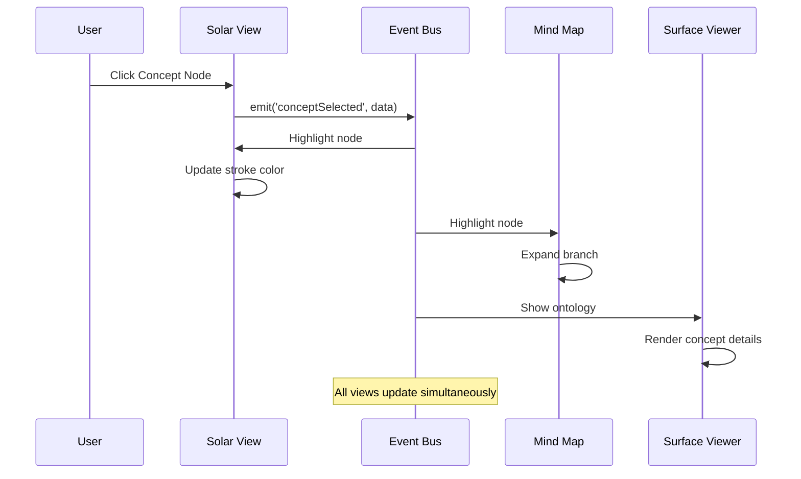
```mermaid
sequenceDiagram
    participant User
    participant Solar as Solar View
    participant Bus as Event Bus
    participant Mind as Mind Map
    participant Surface as Surface Viewer
    
    User->>Solar: Click Concept Node
    Solar->>Bus: emit('conceptSelected', data)
    
    Bus->>Solar: Highlight node
    Solar->>Solar: Update stroke color
    
    Bus->>Mind: Highlight node
    Mind->>Mind: Expand branch
    
    Bus->>Surface: Show ontology
    Surface->>Surface: Render concept details
    
    Note over Bus: All views update simultaneously
```

### 3. Focus Mode Flow

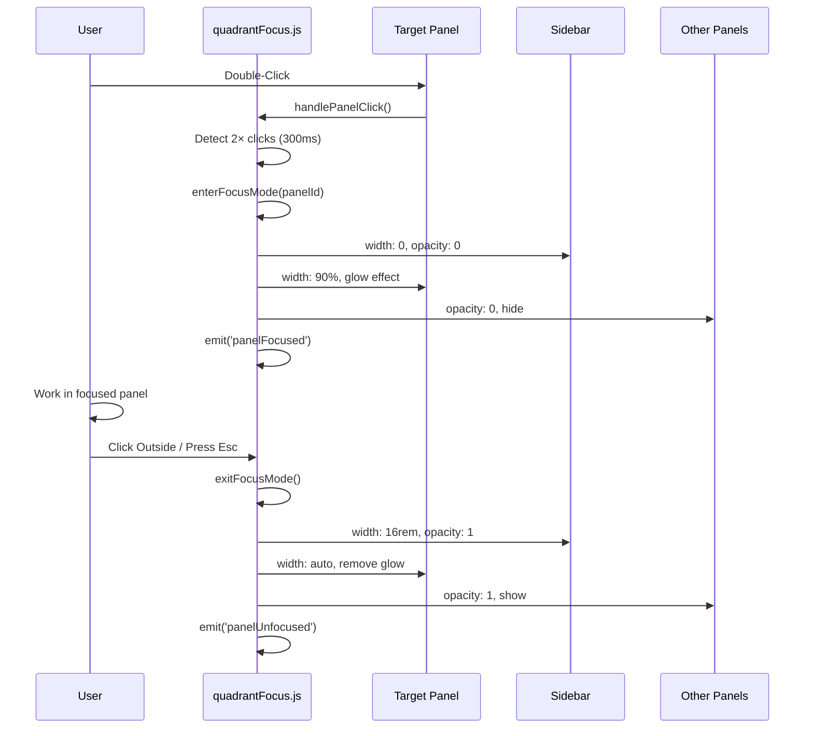
```mermaid
sequenceDiagram
    participant User
    participant Focus as quadrantFocus.js
    participant Panel as Target Panel
    participant Sidebar
    participant Other as Other Panels
    
    User->>Panel: Double-Click
    Panel->>Focus: handlePanelClick()
    Focus->>Focus: Detect 2× clicks (300ms)
    Focus->>Focus: enterFocusMode(panelId)
    
    Focus->>Sidebar: width: 0, opacity: 0
    Focus->>Panel: width: 90%, glow effect
    Focus->>Other: opacity: 0, hide
    Focus->>Focus: emit('panelFocused')
    
    User->>User: Work in focused panel
    
    User->>Focus: Click Outside / Press Esc
    Focus->>Focus: exitFocusMode()
    
    Focus->>Sidebar: width: 16rem, opacity: 1
    Focus->>Panel: width: auto, remove glow
    Focus->>Other: opacity: 1, show
    Focus->>Focus: emit('panelUnfocused')
```

### 4. Semantic Centering Flow

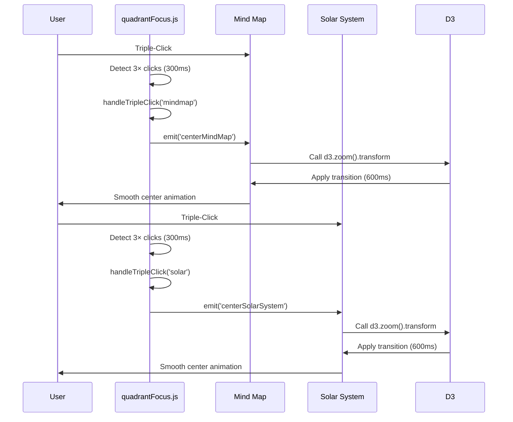
```mermaid
sequenceDiagram
    participant User
    participant Focus as quadrantFocus.js
    participant Mind as Mind Map
    participant Solar as Solar System
    participant D3
    
    User->>Mind: Triple-Click
    Focus->>Focus: Detect 3× clicks (300ms)
    Focus->>Focus: handleTripleClick('mindmap')
    Focus->>Mind: emit('centerMindMap')
    
    Mind->>D3: Call d3.zoom().transform
    D3->>Mind: Apply transition (600ms)
    Mind->>User: Smooth center animation
    
    User->>Solar: Triple-Click
    Focus->>Focus: Detect 3× clicks (300ms)
    Focus->>Focus: handleTripleClick('solar')
    Focus->>Solar: emit('centerSolarSystem')
    
    Solar->>D3: Call d3.zoom().transform
    D3->>Solar: Apply transition (600ms)
    Solar->>User: Smooth center animation
```

---

## Data Flow Diagrams

### 1. Document Ontology Loading

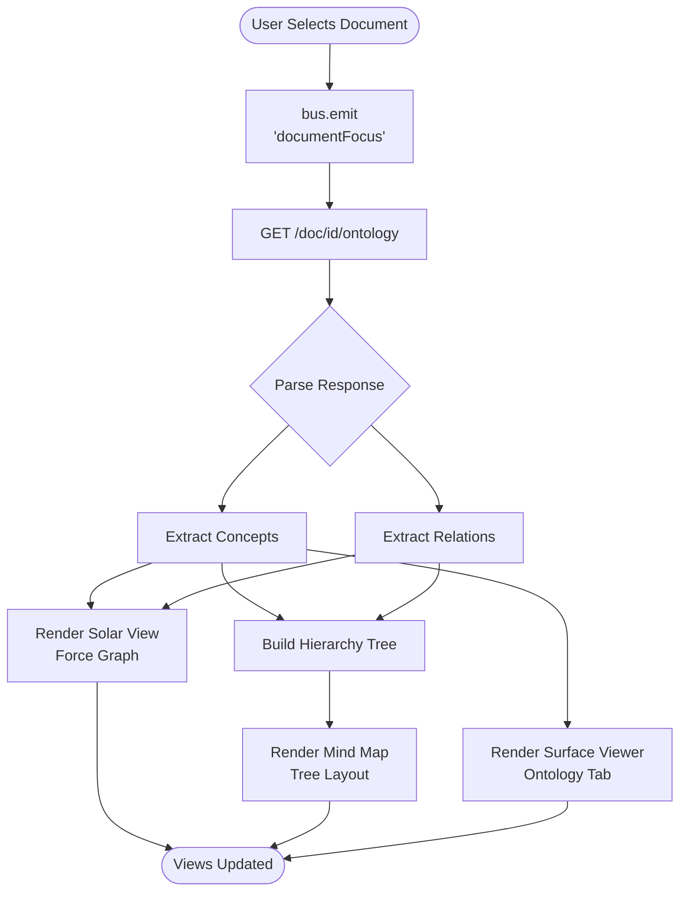
```mermaid
graph TD
    Start([User Selects Document])
    
    Start --> EmitEvent[bus.emit<br/>'documentFocus']
    EmitEvent --> FetchOntology[GET /doc/id/ontology]
    
    FetchOntology --> ParseData{Parse Response}
    ParseData --> Concepts[Extract Concepts]
    ParseData --> Relations[Extract Relations]
    
    Concepts --> RenderSolar[Render Solar View<br/>Force Graph]
    Relations --> RenderSolar
    
    Concepts --> BuildTree[Build Hierarchy Tree]
    Relations --> BuildTree
    BuildTree --> RenderMind[Render Mind Map<br/>Tree Layout]
    
    Concepts --> RenderSurface[Render Surface Viewer<br/>Ontology Tab]
    
    RenderSolar --> Complete([Views Updated])
    RenderMind --> Complete
    RenderSurface --> Complete
```

### 2. Search Result Highlighting

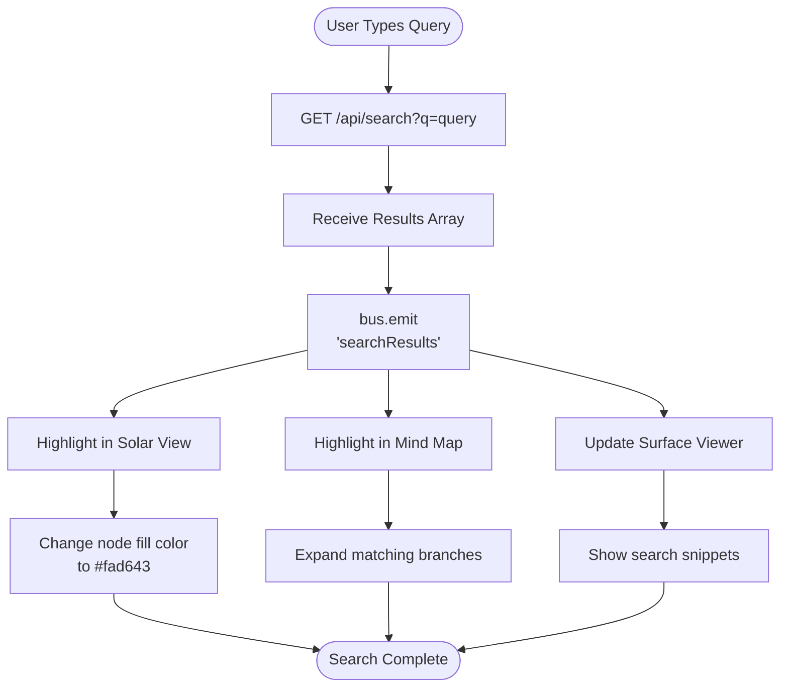
```mermaid
graph TD
    Start([User Types Query])
    
    Start --> SearchAPI[GET /api/search?q=query]
    SearchAPI --> Results[Receive Results Array]
    
    Results --> EmitEvent[bus.emit<br/>'searchResults']
    
    EmitEvent --> HighlightSolar[Highlight in Solar View]
    EmitEvent --> HighlightMind[Highlight in Mind Map]
    EmitEvent --> UpdateSurface[Update Surface Viewer]
    
    HighlightSolar --> ChangeColor[Change node fill color<br/>to #fad643]
    HighlightMind --> ExpandBranch[Expand matching branches]
    UpdateSurface --> ShowSnippet[Show search snippets]
    
    ChangeColor --> Complete([Search Complete])
    ExpandBranch --> Complete
    ShowSnippet --> Complete
```

### 3. View Mode Switching

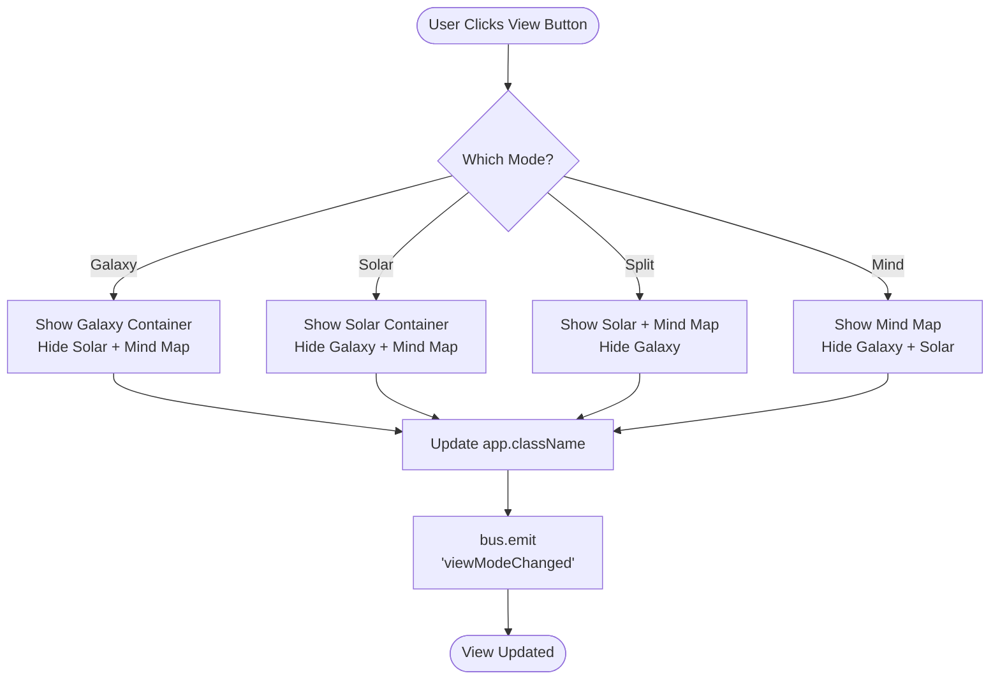
```mermaid
graph TD
    Start([User Clicks View Button])
    
    Start --> GetMode{Which Mode?}
    
    GetMode -->|Galaxy| ShowGalaxy[Show Galaxy Container<br/>Hide Solar + Mind Map]
    GetMode -->|Solar| ShowSolar[Show Solar Container<br/>Hide Galaxy + Mind Map]
    GetMode -->|Split| ShowSplit[Show Solar + Mind Map<br/>Hide Galaxy]
    GetMode -->|Mind| ShowMind[Show Mind Map<br/>Hide Galaxy + Solar]
    
    ShowGalaxy --> UpdateClass[Update app.className]
    ShowSolar --> UpdateClass
    ShowSplit --> UpdateClass
    ShowMind --> UpdateClass
    
    UpdateClass --> EmitEvent[bus.emit<br/>'viewModeChanged']
    
    EmitEvent --> Complete([View Updated])
```

---

## Focus Mode State Machine

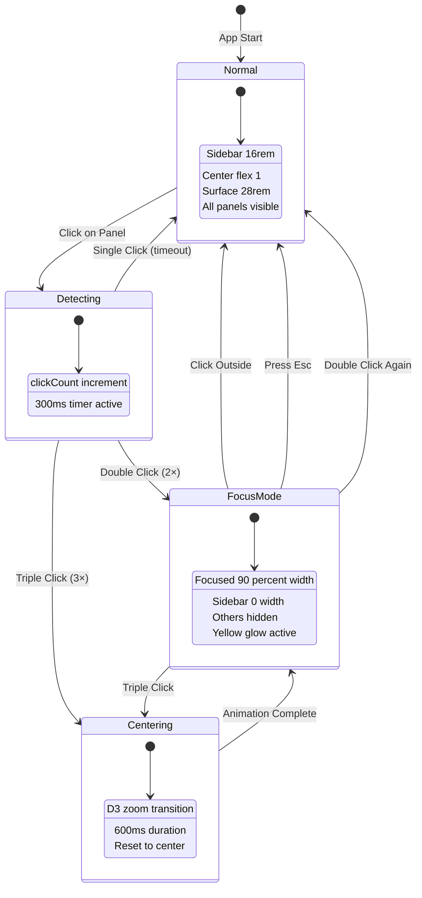
```mermaid
stateDiagram-v2
    [*] --> Normal: App Start
    
    Normal --> Detecting: Click on Panel
    Detecting --> Normal: Single Click (timeout)
    Detecting --> FocusMode: Double Click (2×)
    Detecting --> Centering: Triple Click (3×)
    
    FocusMode --> Normal: Click Outside
    FocusMode --> Normal: Press Esc
    FocusMode --> Normal: Double Click Again
    FocusMode --> Centering: Triple Click
    
    Centering --> FocusMode: Animation Complete
    
    state Normal {
        [*] --> AllVisible
        AllVisible: Sidebar 16rem
        AllVisible: Center flex 1
        AllVisible: Surface 28rem
        AllVisible: All panels visible
    }
    
    state Detecting {
        [*] --> CountingClicks
        CountingClicks: clickCount increment
        CountingClicks: 300ms timer active
    }
    
    state FocusMode {
        [*] --> PanelExpanded
        PanelExpanded: Focused 90 percent width
        PanelExpanded: Sidebar 0 width
        PanelExpanded: Others hidden
        PanelExpanded: Yellow glow active
    }
    
    state Centering {
        [*] --> Animating
        Animating: D3 zoom transition
        Animating: 600ms duration
        Animating: Reset to center
    }
```

---

## Click Detection State Machine

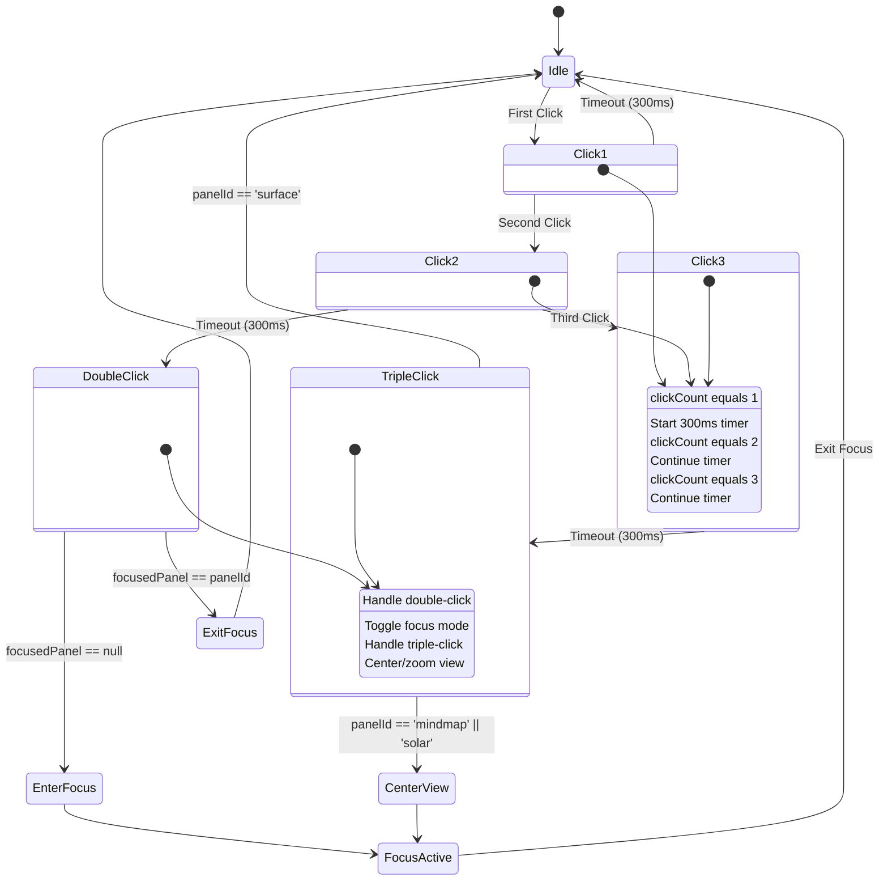
```mermaid
stateDiagram-v2
    [*] --> Idle
    
    Idle --> Click1: First Click
    Click1 --> Idle: Timeout (300ms)
    Click1 --> Click2: Second Click
    Click2 --> DoubleClick: Timeout (300ms)
    Click2 --> Click3: Third Click
    Click3 --> TripleClick: Timeout (300ms)
    
    DoubleClick --> EnterFocus: focusedPanel == null
    DoubleClick --> ExitFocus: focusedPanel == panelId
    
    EnterFocus --> FocusActive
    ExitFocus --> Idle
    
    TripleClick --> CenterView: panelId == 'mindmap' || 'solar'
    TripleClick --> Idle: panelId == 'surface'
    
    CenterView --> FocusActive
    FocusActive --> Idle: Exit Focus
    
    state Click1 {
        [*] --> Counting
        Counting: clickCount equals 1
        Counting: Start 300ms timer
    }
    
    state Click2 {
        [*] --> Counting
        Counting: clickCount equals 2
        Counting: Continue timer
    }
    
    state Click3 {
        [*] --> Counting
        Counting: clickCount equals 3
        Counting: Continue timer
    }
    
    state DoubleClick {
        [*] --> Processing
        Processing: Handle double-click
        Processing: Toggle focus mode
    }
    
    state TripleClick {
        [*] --> Processing
        Processing: Handle triple-click
        Processing: Center/zoom view
    }
```

---

## Component Interaction Map

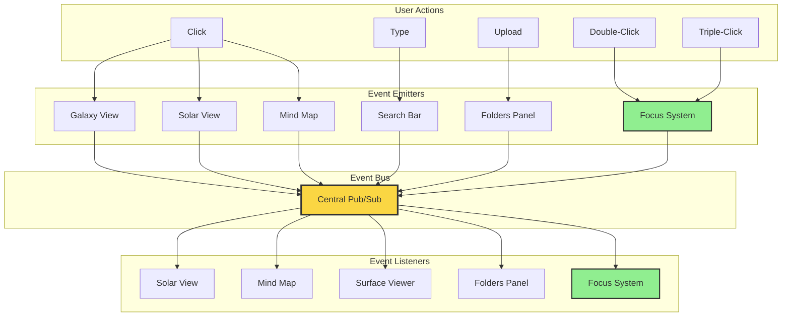
```mermaid
graph TB
    subgraph User Actions
        Click[Click]
        DoubleClick[Double-Click]
        TripleClick[Triple-Click]
        Type[Type]
        Upload[Upload]
    end
    
    subgraph Event Emitters
        Galaxy[Galaxy View]
        Solar[Solar View]
        Mind[Mind Map]
        Search[Search Bar]
        Folders[Folders Panel]
        Focus[Focus System]
    end
    
    subgraph Event Bus
        Bus[Central Pub/Sub]
    end
    
    subgraph Event Listeners
        SolarL[Solar View]
        MindL[Mind Map]
        SurfaceL[Surface Viewer]
        FoldersL[Folders Panel]
        FocusL[Focus System]
    end
    
    Click --> Galaxy
    Click --> Solar
    Click --> Mind
    DoubleClick --> Focus
    TripleClick --> Focus
    Type --> Search
    Upload --> Folders
    
    Galaxy --> Bus
    Solar --> Bus
    Mind --> Bus
    Search --> Bus
    Folders --> Bus
    Focus --> Bus
    
    Bus --> SolarL
    Bus --> MindL
    Bus --> SurfaceL
    Bus --> FoldersL
    Bus --> FocusL
    
    style Bus fill:#fad643,stroke:#333,stroke-width:3px
    style Focus fill:#90EE90,stroke:#333,stroke-width:2px
    style FocusL fill:#90EE90,stroke:#333,stroke-width:2px
```

---

## API Request Flow

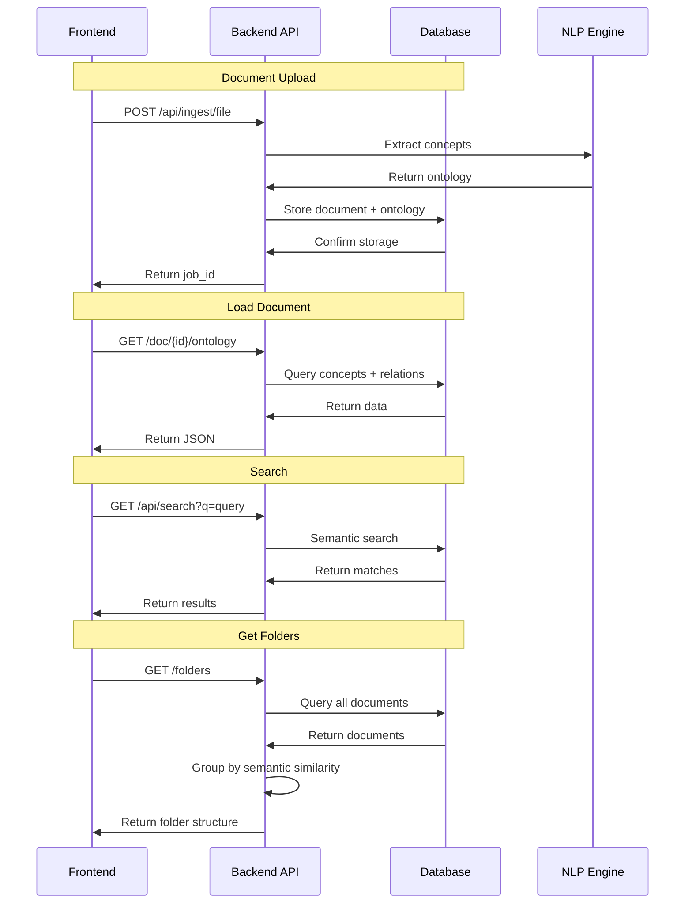
```mermaid
sequenceDiagram
    participant UI as Frontend
    participant API as Backend API
    participant DB as Database
    participant NLP as NLP Engine
    
    Note over UI,DB: Document Upload
    UI->>API: POST /api/ingest/file
    API->>NLP: Extract concepts
    NLP->>API: Return ontology
    API->>DB: Store document + ontology
    DB->>API: Confirm storage
    API->>UI: Return job_id
    
    Note over UI,DB: Load Document
    UI->>API: GET /doc/{id}/ontology
    API->>DB: Query concepts + relations
    DB->>API: Return data
    API->>UI: Return JSON
    
    Note over UI,DB: Search
    UI->>API: GET /api/search?q=query
    API->>DB: Semantic search
    DB->>API: Return matches
    API->>UI: Return results
    
    Note over UI,DB: Get Folders
    UI->>API: GET /folders
    API->>DB: Query all documents
    DB->>API: Return documents
    API->>API: Group by semantic similarity
    API->>UI: Return folder structure
```

---

## Rendering Pipeline

### Solar System View Rendering

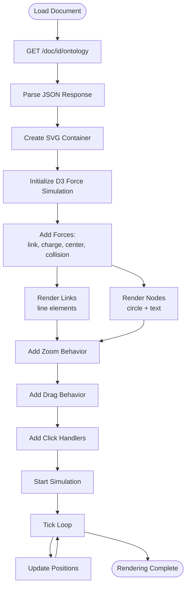
```mermaid
graph TD
    Start([Load Document])
    
    Start --> FetchData[GET /doc/id/ontology]
    FetchData --> ParseJSON[Parse JSON Response]
    
    ParseJSON --> CreateSVG[Create SVG Container]
    CreateSVG --> InitForce[Initialize D3 Force Simulation]
    
    InitForce --> AddForces[Add Forces:<br/>link, charge, center, collision]
    
    AddForces --> RenderLinks[Render Links<br/>line elements]
    AddForces --> RenderNodes[Render Nodes<br/>circle + text]
    
    RenderLinks --> AddZoom[Add Zoom Behavior]
    RenderNodes --> AddZoom
    
    AddZoom --> AddDrag[Add Drag Behavior]
    AddDrag --> AddClick[Add Click Handlers]
    
    AddClick --> StartSim[Start Simulation]
    StartSim --> Tick[Tick Loop]
    
    Tick --> UpdatePos[Update Positions]
    UpdatePos --> Tick
    
    Tick --> Complete([Rendering Complete])
```

### Mind Map View Rendering

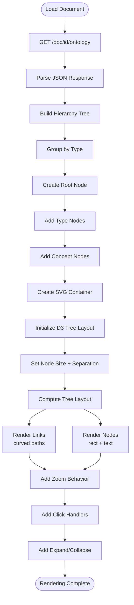
```mermaid
graph TD
    Start([Load Document])
    
    Start --> FetchData[GET /doc/id/ontology]
    FetchData --> ParseJSON[Parse JSON Response]
    
    ParseJSON --> BuildTree[Build Hierarchy Tree]
    BuildTree --> GroupTypes[Group by Type]
    
    GroupTypes --> CreateRoot[Create Root Node]
    CreateRoot --> AddChildren[Add Type Nodes]
    AddChildren --> AddConcepts[Add Concept Nodes]
    
    AddConcepts --> CreateSVG[Create SVG Container]
    CreateSVG --> InitTree[Initialize D3 Tree Layout]
    
    InitTree --> SetNodeSize[Set Node Size + Separation]
    SetNodeSize --> ComputeLayout[Compute Tree Layout]
    
    ComputeLayout --> RenderLinks[Render Links<br/>curved paths]
    ComputeLayout --> RenderNodes[Render Nodes<br/>rect + text]
    
    RenderLinks --> AddZoom[Add Zoom Behavior]
    RenderNodes --> AddZoom
    
    AddZoom --> AddClick[Add Click Handlers]
    AddClick --> AddExpand[Add Expand/Collapse]
    
    AddExpand --> Complete([Rendering Complete])
```

---

## Focus Mode Transitions

### Enter Focus Mode Animation

```mermaid
gantt
    title Focus Mode Enter Animation (400ms)
    dateFormat X
    axisFormat %L ms
    
    section Sidebar
    Width 16rem → 0     :0, 400
    Opacity 1 → 0       :0, 400
    
    section Focused Panel
    Width auto → 90%    :0, 400
    Add glow effect     :300, 100
    
    section Other Panels
    Opacity 1 → 0       :0, 400
    Hide completely     :350, 50
    
    section Resize Handles
    Opacity 1 → 0       :0, 200
    Pointer events off  :200, 1
```

### Exit Focus Mode Animation

```mermaid
gantt
    title Focus Mode Exit Animation (400ms)
    dateFormat X
    axisFormat %L ms
    
    section Sidebar
    Width 0 → 16rem     :0, 400
    Opacity 0 → 1       :0, 400
    
    section Focused Panel
    Width 90% → auto    :0, 400
    Remove glow effect  :0, 100
    
    section Other Panels
    Show panels         :0, 50
    Opacity 0 → 1       :0, 400
    
    section Resize Handles
    Opacity 0 → 1       :200, 200
    Pointer events on   :400, 1
```

---

## Performance Optimization Flow

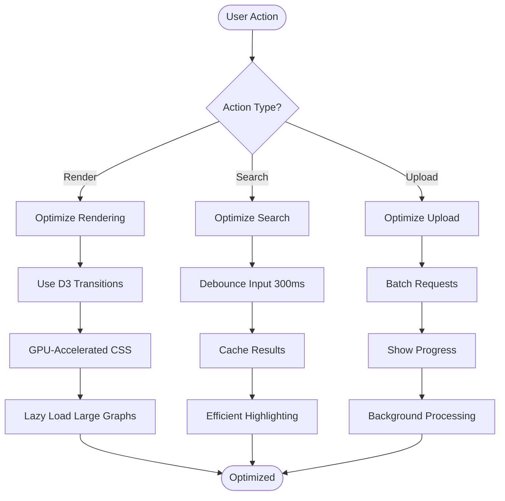
```mermaid
graph TD
    Start([User Action])
    
    Start --> Check{Action Type?}
    
    Check -->|Render| OptRender[Optimize Rendering]
    Check -->|Search| OptSearch[Optimize Search]
    Check -->|Upload| OptUpload[Optimize Upload]
    
    OptRender --> UseD3[Use D3 Transitions]
    UseD3 --> GPUAccel[GPU-Accelerated CSS]
    GPUAccel --> LazyLoad[Lazy Load Large Graphs]
    
    OptSearch --> Debounce[Debounce Input 300ms]
    Debounce --> Cache[Cache Results]
    Cache --> Highlight[Efficient Highlighting]
    
    OptUpload --> Batch[Batch Requests]
    Batch --> Progress[Show Progress]
    Progress --> Background[Background Processing]
    
    LazyLoad --> Complete([Optimized])
    Highlight --> Complete
    Background --> Complete
```

---

## Error Handling Flow

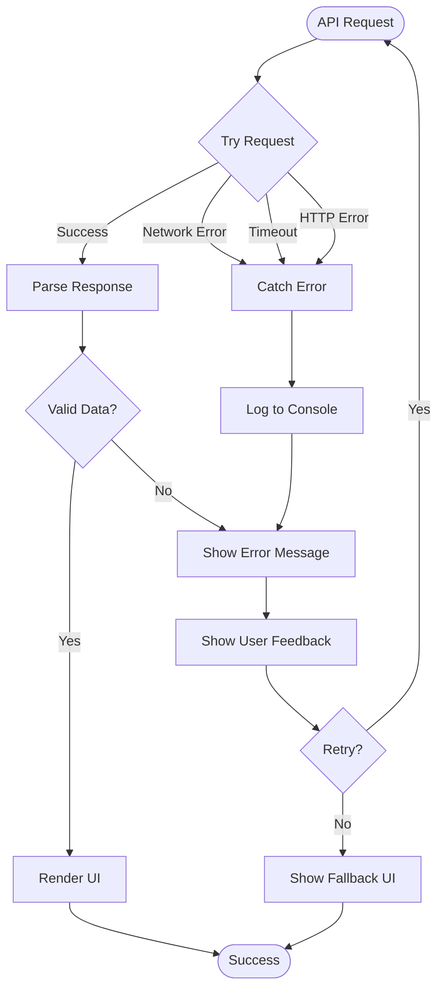
```mermaid
graph TD
    Start([API Request])
    
    Start --> Try{Try Request}
    
    Try -->|Success| ParseResponse[Parse Response]
    Try -->|Network Error| CatchError[Catch Error]
    Try -->|Timeout| CatchError
    Try -->|HTTP Error| CatchError
    
    ParseResponse --> ValidateData{Valid Data?}
    ValidateData -->|Yes| RenderUI[Render UI]
    ValidateData -->|No| ShowError[Show Error Message]
    
    CatchError --> LogError[Log to Console]
    LogError --> ShowError
    
    ShowError --> UserFeedback[Show User Feedback]
    UserFeedback --> Retry{Retry?}
    
    Retry -->|Yes| Start
    Retry -->|No| Fallback[Show Fallback UI]
    
    RenderUI --> Complete([Success])
    Fallback --> Complete
```

---

## Conclusion

These diagrams provide a comprehensive visual reference for understanding LoomLite's architecture, data flow, and interaction patterns. Use them alongside the Developer Handoff document for complete system understanding.

---

*Document Version: 1.0*  
*Last Updated: October 26, 2025*  
*LoomLite v4.0 - System Flow Diagrams*

